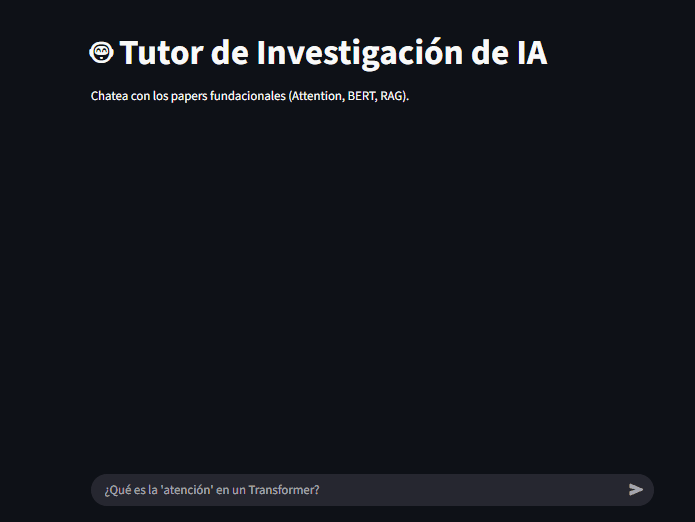

# 🤖 Tutor de Investigación Científica de IA 

**Proyecto Final para la materia:** S.A.C. - Modelos y Aplicaciones de la Inteligencia Artificial.

**Instituto:** IPF "Dr. Alberto Marcelo Zerrilla"

Este proyecto es una solución de software basada en IA utilizando la arquitectura RAG (Retrieval-Augmented Generation) para actuar como un "Tutor de Investigación" experto. 

Su base de conocimiento se compone exclusivamente de tres papers fundacionales de la IA moderna:

- Attention Is All You Need" (Vaswani et al., 2017)

- BERT: Pre-training of Deep Bidirectional Transformers for Language Understanding (Devlin et al., 2018)

- Retrieval-Augmented Generation for Knowledge-Intensive NLP
Tasks" (Lewis et al., 2020) 

---

### 🚀 Demo 

Aquí puedes ver el chatbot en funcionamiento, respondiendo una pregunta sobre un concepto técnico y citando correctamente su fuente.



### 🎯 El Problema y la Solución (Caso de Uso)

* **El Problema:** Un estudiante necesita consultar conceptos técnicos complejos de los papers fundacionales (ej. "¿Qué es la 'atención' en un Transformer?"). El sistema debe ser capaz de explicar estos conceptos basándose exclusivamente en el contenido de los tres papers.

* **La Solución:** Este asistente de chat, construido con arquitectura RAG, ingiere los tres papers fundacionales[cite: 86]. [cite_start]El sistema recupera el contexto más relevante para responder preguntas en lenguaje natural sobre los fundamentos de las arquitecturas Transformer, BERT y RAG[cite: 88, 89].

* **Requisito Cumplido:** Al generar una respuesta, el sistema debe citar cuál de los tres papers utilizó como fuente principal para esa respuesta.

---

### 🛠️ Stack Tecnológico

* **Arquitectura:** RAG (Retrieval-Augmented Generation) 
* **Framework RAG:** LangChain (utilizando LCEL) 
* **Base de Datos Vectorial:** ChromaDB (Persistente) 
* **Modelo de Embedding:** Ollama (`nomic-embed-text`) 
* **Modelo de Lenguaje (LLM):** Google Vertex AI (`gemini-2.5-flash`)
* **Frontend:** Streamlit 
* **Lenguaje:** Python

---

### 📦 Instalación 

Sigue estos pasos para clonar el repositorio e instalar todas las dependencias necesarias.

**1. Clonar el Repositorio:**
```bash
git clone https://github.com/GastonFlorenciano/Tutor-Cientifico-RAG.git

# Ir al directorio del repositorio
cd Tutor-Cientifico-RAG
```

**2. Crear y Activar un Entorno Virtual:**
```bash
# Crear el entorno
python -m venv venv

# Activar en Windows
.\venv\Scripts\activate

# Activar en macOS/Linux
source venv/bin/activate
```

**3. Instalar dependencias:**
```bash
pip install -r requirements.txt
```

**4. Configurar Modelos y Credenciales (Gemini y Ollama):**

* **Google AI (LLM - API Key):** El proyecto utiliza la clave API de Google AI Studio (no de Google Cloud).
    1.  Crea un archivo llamado **`.env`** en la raíz del proyecto.
    2.  Añade tu clave al archivo, siguiendo este formato:
        ```text
        GOOGLE_API_KEY="TU_CLAVE_API_VA_AQUI"
        ```

* **Ollama (Modelo de Embedding):** El proyecto depende de que el servidor local de Ollama esté corriendo.
    1.  Asegúrate de tener [Ollama instalado y ejecutándose](https://ollama.com/download).
    2.  Descarga el modelo de embeddings necesario en tu terminal:
        ```bash
        ollama pull nomic-embed-text
        ```

### ▶️ Instrucciones de Uso

**1. En la terminal ejecuta.**

```bash
streamlit run app.py
```
